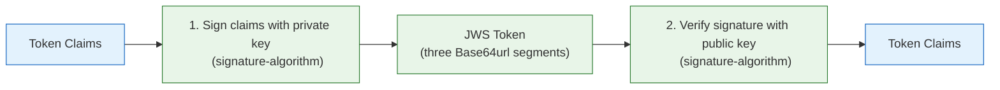
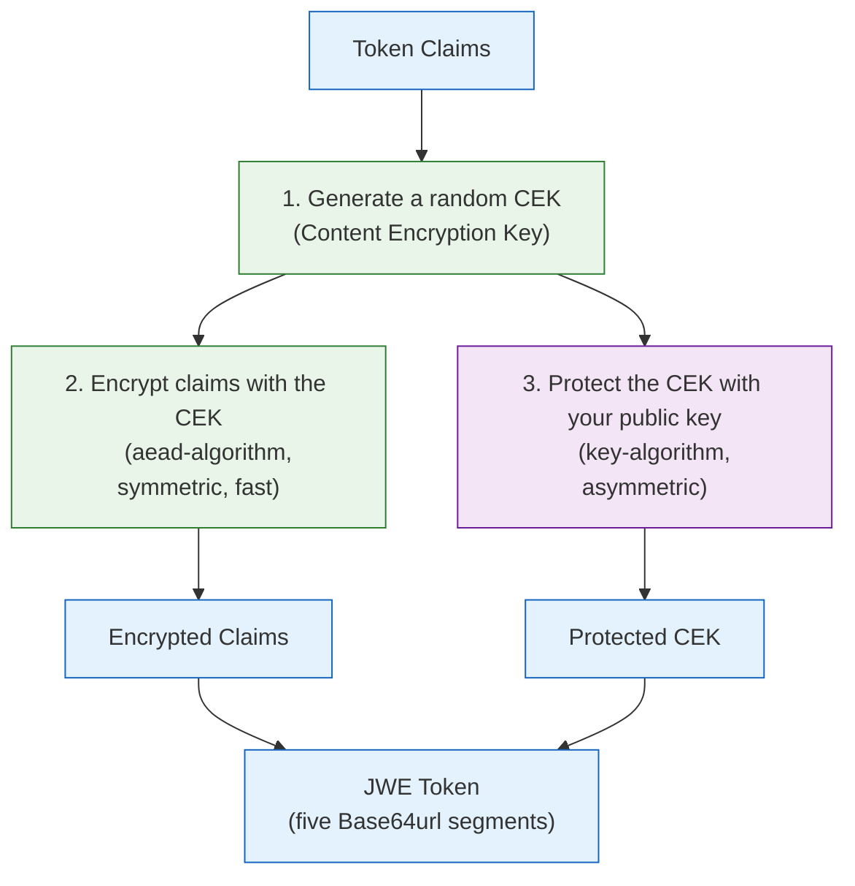
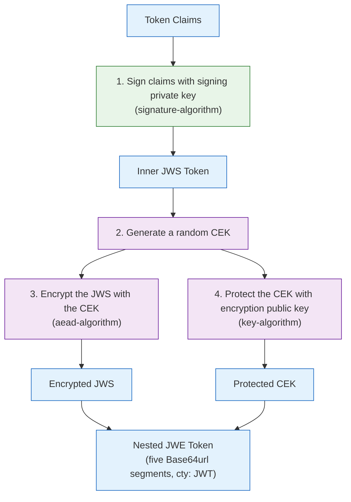

# authn-core

[](https://www.apache.org/licenses/LICENSE-2.0)
[](https://mvnrepository.com/artifact/group.phorus/authn-core)
[](https://codecov.io/gh/phorus-group/authn-core)

Core authentication library for Phorus services. Framework-agnostic JWT token creation,
token validation, Identity Provider integration, context objects, DTOs, and service interfaces.

For Spring Boot auto-configuration (filters, YAML config, API keys, privilege gates), see
[authn-spring-boot-starter](https://github.com/phorus-group/authn-spring-boot-starter).

### Notes

> The project runs a vulnerability analysis pipeline regularly,
> any found vulnerabilities will be fixed as soon as possible.

> The project dependencies are being regularly updated by [Renovate](https://github.com/phorus-group/renovate).

## Table of contents

- [Getting started](#getting-started)
  - [Installation](#installation)
  - [Quick start](#quick-start)
- [Core concepts](#core-concepts)
  - [Token formats](#token-formats)
    - [Message-Level Encryption (MLE)](#message-level-encryption-mle)
  - [Authentication modes](#authentication-modes)
    - [STANDALONE (default)](#standalone-default)
    - [IDP_BRIDGE](#idp_bridge)
    - [IDP_DELEGATED](#idp_delegated)
  - [Identity Providers (IdPs)](#identity-providers-idps)
    - [IdP claim mapping reference](#idp-claim-mapping-reference)
  - [Privileges](#privileges)
- [Configuration](#configuration)
- [Core implementations](#core-implementations)
  - [TokenCreator](#tokencreator)
  - [StandaloneTokenValidator](#standalonetokenvalidator)
  - [IdpTokenValidator](#idptokenvalidator)
  - [JwksKeyLocator](#jwkskeylocator)
- [Context objects](#context-objects)
  - [AuthContext](#authcontext)
  - [HTTPContext](#httpcontext)
  - [ApiKeyContext](#apikeycontext)
- [DTOs](#dtos)
- [Service interfaces](#service-interfaces)
- [Keys and algorithms](#keys-and-algorithms)
  - [Token format requirements](#token-format-requirements)
  - [Key type](#key-type)
  - [How token protection works](#how-token-protection-works)
    - [How JWS works (signing)](#how-jws-works-signing)
    - [How JWE works (encryption)](#how-jwe-works-encryption)
    - [How nested JWE works (signing + encryption)](#how-nested-jwe-works-signing--encryption)
  - [Encryption algorithm reference](#encryption-algorithm-reference)
  - [Configuring and generating keys](#configuring-and-generating-keys)
- [Security considerations](#security-considerations)
- [Standards references](#standards-references)
- [Building and contributing](#building-and-contributing)
- [Authors and acknowledgment](#authors-and-acknowledgment)

***

## Getting started

### Installation

<details open>
<summary>Gradle / Kotlin DSL</summary>

```kotlin
implementation("group.phorus:authn-core:x.y.z")
```
</details>

<details open>
<summary>Maven</summary>

```xml
<dependency>
    <groupId>group.phorus</groupId>
    <artifactId>authn-core</artifactId>
    <version>x.y.z</version>
</dependency>
```
</details>

### Quick start

**1. Generate an EC key pair:**

```bash
openssl ecparam -genkey -name secp384r1 -noout -out key.pem
openssl pkcs8 -topk8 -nocrypt -in key.pem -outform DER -out private.der
openssl ec -in key.pem -pubout -outform DER -out public.der
openssl base64 -A -in private.der && echo    # -> encodedPrivateKey
openssl base64 -A -in public.der && echo     # -> encodedPublicKey
rm key.pem private.der public.der
```

**2. Use the keys:**

```kotlin
import group.phorus.authn.core.config.*
import group.phorus.authn.core.services.impl.TokenCreator
import group.phorus.authn.core.services.impl.StandaloneTokenValidator
import java.util.UUID

// 1. Configure
val config = AuthNConfig(
    mode = AuthMode.STANDALONE,
    jwt = JwtConfig(
        issuer = "my-service",
        tokenFormat = TokenFormat.JWS,
        signing = SigningConfig(
            algorithm = "EC",
            encodedPrivateKey = "<base64 PKCS#8 private key>",
            encodedPublicKey = "<base64 X.509 public key>",
        ),
    ),
)

// 2. Create tokens
val tokenCreator = TokenCreator(config)
val accessToken = tokenCreator.createAccessToken(
    userId = UUID.randomUUID(),
    privileges = listOf("read", "write"),
)

// 3. Validate tokens
val validator = StandaloneTokenValidator(config, validators = emptyList())
val authData = validator.authenticate(accessToken.token)
println("User: ${authData.userId}, Privileges: ${authData.privileges}")
```

## Core concepts

### Token formats

When creating a token, the library can protect the claims in three different ways:

| Format | What it does | Trade-offs |
|--------|-------------|------------|
| **JWS** (signed) | Signs the claims so nobody can tamper with them, but anyone can read them | Integrity + authenticity. Claims visible (base64 encoded). Widely used by OAuth 2.0 IdPs. |
| **JWE** (encrypted) | Encrypts the claims so nobody can read them, but there is no signature | Confidentiality only. No integrity guarantee without additional mechanisms. |
| **Nested JWE** (signed + encrypted) | Signs the claims first, then encrypts the signed result | Both integrity and confidentiality. Higher overhead (encrypt + decrypt + verify). |

**When to use each format:**

- **JWS** is sufficient when claims do not contain sensitive data and you only need to verify that
  the token was not tampered with. This is the most common format for access tokens that carry
  user IDs and roles.
- **JWE** is useful when token claims contain sensitive data (personal identifiers, internal
  metadata) and confidentiality is required, but the token is only consumed by systems that share
  the encryption key.
- **Nested JWE** provides both confidentiality and integrity. It is used in environments where
  tokens pass through intermediaries (proxies, gateways, message queues) and must remain both
  unreadable and tamper-proof. This is also the format used by IdPs that implement
  [Message-Level Encryption (MLE)](#message-level-encryption-mle).

The token format is configured via `JwtConfig.tokenFormat` and only affects how the library
**creates** tokens. When **validating** incoming tokens, the library auto-detects the format,
so a service can accept tokens created by a previous deployment that used a different format.

For detailed diagrams and step-by-step breakdowns of how each format works internally, see
[How token protection works](#how-token-protection-works).

**Configuration examples:**

```kotlin
// JWS
val config = AuthNConfig(
    jwt = JwtConfig(
        tokenFormat = TokenFormat.JWS,
        signing = SigningConfig(algorithm = "EC", encodedPrivateKey = "...", encodedPublicKey = "..."),
    ),
)

// JWE
val config = AuthNConfig(
    jwt = JwtConfig(
        tokenFormat = TokenFormat.JWE,
        encryption = EncryptionConfig(
            algorithm = "EC", keyAlgorithm = "ECDH-ES+A256KW", aeadAlgorithm = "A192CBC-HS384",
            encodedPublicKey = "...", encodedPrivateKey = "...",
        ),
    ),
)

// Nested JWE (both signing and encryption key pairs required)
val config = AuthNConfig(
    jwt = JwtConfig(
        tokenFormat = TokenFormat.NESTED_JWE,
        signing = SigningConfig(algorithm = "EC", encodedPrivateKey = "...", encodedPublicKey = "..."),
        encryption = EncryptionConfig(
            algorithm = "EC", keyAlgorithm = "ECDH-ES+A256KW", aeadAlgorithm = "A192CBC-HS384",
            encodedPublicKey = "...", encodedPrivateKey = "...",
        ),
    ),
)
```

#### Message-Level Encryption (MLE)

Message-Level Encryption (MLE) is a security pattern where the token payload is encrypted at the
application level, independent of transport security (HTTPS/TLS). With MLE, even if TLS is
terminated at a load balancer, CDN, or API gateway, the token contents remain encrypted and
unreadable to those intermediaries.

**How it works:** the token issuer encrypts the payload using the recipient's public key. Only the
recipient, who holds the corresponding private key, can decrypt and read the contents. When
combined with a signature (nested JWE), the recipient can also verify that the contents were not
modified.

**Advantages over transport-only security:**

- **End-to-end confidentiality**: token contents are protected even when TLS terminates at an
  intermediary (reverse proxy, API gateway, CDN) before reaching your service.
- **Defense in depth**: adds a second layer of protection if TLS is misconfigured, downgraded,
  or compromised.
- **Auditability without exposure**: intermediaries can log and route tokens without being able
  to read their contents.

**Common use cases:**

- IdPs that require MLE for regulatory compliance (e.g. financial services, eIDAS, PSD2).
- Architectures where tokens pass through untrusted intermediaries.
- Systems handling tokens that contain personally identifiable information (PII).

MLE applies in two scenarios:

1. **IdP tokens**: some IdPs send nested JWE tokens. Configure `IdpEncryptionConfig.encodedPrivateKey`
   so the library can decrypt them before verifying the inner signature.
2. **Self-issued tokens**: setting `tokenFormat = TokenFormat.NESTED_JWE` creates tokens that follow
   the same sign-then-encrypt pattern.

### Authentication modes

The `AuthMode` enum controls how tokens are created and validated. Pick the one that matches
your architecture.

| Mode | Description | What you need |
|------|-------------|---------------|
| **`STANDALONE`** (default) | Your service creates **and** validates its own tokens. No external IdP. | Signing and/or encryption keys. |
| **`IDP_BRIDGE`** | An external IdP handles login. Your service validates the IdP token, extracts the user, and mints its own tokens for internal use. | IdP config (JWKS endpoint) **and** signing/encryption keys. |
| **`IDP_DELEGATED`** | Your service only validates IdP-issued tokens. No own token creation. Refresh is the IdP's responsibility. | IdP config (JWKS endpoint). |

#### STANDALONE (default)

**When to use:** your service manages its own user accounts and does not use an external login
service.

Your service creates tokens (via `TokenCreator`) when users log in and validates them (via
`StandaloneTokenValidator`) on every subsequent request. No external IdP is involved.

#### IDP_BRIDGE

**When to use:** you use an external IdP for login (Auth0, Keycloak, etc.) but want to create
your own tokens internally. Common reasons: you need encrypted tokens (most IdPs only issue
signed tokens), you want to enrich the token with data from your database, or you want a
consistent token format across multiple IdPs.

Your service receives the IdP token, validates it using `IdpTokenValidator`, extracts the user
identity, and creates its own token via `TokenCreator`. From that point on, the client uses
your service's token for all subsequent requests, validated by `StandaloneTokenValidator`.

How the backend obtains the IdP token depends on the OAuth 2.0 flow:

- **Authorization code flow** (most common for web applications): the frontend redirects the
  user to the IdP. After login, the IdP redirects back with an authorization code. The frontend
  sends this code to your backend, which exchanges it for a token at the IdP's token endpoint.
  The exchange is done by your code (e.g. using an HTTP client); authn-core handles only the
  validation step afterward.
- **Direct token flow** (common with native SDKs and SPAs using PKCE): the client obtains the
  token directly from the IdP (e.g. via Firebase Auth, Google Sign-In, or a PKCE flow). The
  client then sends the token to your backend for validation.

#### IDP_DELEGATED

**When to use:** you use an external IdP and are happy with its tokens as-is. This is the
simplest IdP setup. Your service never creates tokens. Token refresh is handled entirely by
the IdP on the client side.

The client authenticates with the IdP using any standard OAuth 2.0 flow (authorization code
with PKCE, device authorization, client credentials, etc.) and obtains tokens directly from
the IdP. The client includes the IdP token in the `Authorization: Bearer <token>` header on
every request to your service. `IdpTokenValidator` (with `JwksKeyLocator`) validates every
incoming request.

### Identity Providers (IdPs)

An Identity Provider (IdP) is a third-party service that manages user accounts and handles
authentication on your behalf. Examples include Auth0, Azure AD / Entra ID, Google, Keycloak,
and Okta.

The library auto-detects the IdP token format:

- **JWS** (signed): signature verified using the IdP's JWKS public keys via `JwksKeyLocator`.
- **JWE** (encrypted): decrypted using your configured private key.
- **Nested JWE** (signed then encrypted): decrypted first, then the inner JWS signature is
  verified via JWKS. Some IdPs use this for [Message-Level Encryption (MLE)](#message-level-encryption-mle).

JWE and nested JWE require configuring `IdpEncryptionConfig.encodedPrivateKey` with a private key
whose corresponding public key is registered with the IdP.

#### IdP claim mapping reference

Different IdPs use different claim names. Configure `IdpConfig.claims` to tell the library which
claims to read:

| IdP | Subject claim | Privileges claim | Notes |
|-----|--------------|-----------------|-------|
| Auth0 | `sub` (default) | `permissions` or `scope` | Subject format: `"auth0\|abc123"` |
| Azure AD / Entra ID | `oid` | `roles` or `scp` | `oid` is the user object ID |
| Google / Firebase | `sub` (default) | `scope` or custom | |
| Keycloak | `sub` (default) | `realm_access.roles` | Dot notation for nested claims |
| Okta | `sub` (default) | `scp` or `groups` | |

Privilege extraction supports three formats transparently:
- **Space-separated string**: `"read write admin"` (Auth0 `scope`, Azure AD `scp`)
- **JSON array**: `["read", "write", "admin"]` (Auth0 `permissions`, Okta `scp`, Azure AD `roles`)
- **Nested path with dot notation**: `realm_access.roles` resolves `{"realm_access": {"roles": ["admin"]}}` (Keycloak)

### Privileges

Privileges are a list of strings that describe what the user is allowed to do. They are stored
inside the token as a claim and extracted by the library into `AuthData.privileges`.

```kotlin
val authData = authenticator.authenticate(token)
if ("admin" in authData.privileges) {
    // user has admin access
}
```

The library does not manage where privileges come from. It only reads them from the token.
Whoever creates the token is responsible for putting the right privileges in it.

- In **standalone mode**, your service creates the tokens, so you decide what privileges to include
  (e.g. from your database).
- In **IdP modes**, the IdP embeds privileges in the token. Different IdPs call them different
  things: `scope`, `scp`, `permissions`, `roles`, `groups`, etc.
  The `ClaimsMapping.privileges` property tells the library which claim name to read.

## Configuration

The `AuthNConfig` data class provides all settings needed for token creation and validation:

| Property | Type | Default | Description |
|----------|------|---------|-------------|
| `mode` | `AuthMode` | `STANDALONE` | Authentication mode |
| `jwt.issuer` | `String?` | `null` | `iss` claim value |
| `jwt.tokenFormat` | `TokenFormat` | `JWS` | Token serialization format |
| `jwt.signing.algorithm` | `String` | `"EC"` | JCA key-factory algorithm |
| `jwt.signing.signatureAlgorithm` | `String?` | `null` | JJWT signature algorithm (auto-detected if null) |
| `jwt.signing.encodedPrivateKey` | `String?` | `null` | Base64 PKCS#8 private key for signing |
| `jwt.signing.encodedPublicKey` | `String?` | `null` | Base64 X.509 public key for verification |
| `jwt.encryption.algorithm` | `String` | `"EC"` | JCA key-factory algorithm |
| `jwt.encryption.keyAlgorithm` | `String` | `"ECDH-ES+A256KW"` | JJWT key-management algorithm |
| `jwt.encryption.aeadAlgorithm` | `String` | `"A192CBC-HS384"` | JJWT content-encryption algorithm |
| `jwt.encryption.encodedPublicKey` | `String?` | `null` | Base64 X.509 public key for encryption |
| `jwt.encryption.encodedPrivateKey` | `String?` | `null` | Base64 PKCS#8 private key for decryption |
| `jwt.expiration.tokenMinutes` | `Long` | `10` | Access token lifetime in minutes |
| `jwt.expiration.refreshTokenMinutes` | `Long` | `1440` | Refresh token lifetime in minutes |
| `idp.issuerUri` | `String?` | `null` | IdP issuer identifier, validates `iss` claim |
| `idp.jwkSetUri` | `String?` | `null` | URL of the IdP's JWKS endpoint |
| `idp.jwksCacheTtlMinutes` | `Long` | `60` | How long fetched JWKS keys are cached |
| `idp.claims.subject` | `String` | `"sub"` | Claim name for the user identifier |
| `idp.claims.privileges` | `String` | `"scope"` | Claim name for scopes/roles/permissions |
| `idp.encryption.algorithm` | `String` | `"RSA"` | Key algorithm for IdP JWE decryption |
| `idp.encryption.encodedPrivateKey` | `String?` | `null` | Base64 PKCS#8 private key for IdP JWE decryption |

## Core implementations

### TokenCreator

`TokenCreator` implements the `TokenFactory` interface. It creates access and refresh tokens in
the configured format (JWS, JWE, or nested JWE). Pass an `AuthNConfig` to its constructor.

### StandaloneTokenValidator

`StandaloneTokenValidator` implements the `Authenticator` interface. It validates tokens created
by `TokenCreator` (or any standards-compliant JWT library). Token format is auto-detected at parse
time based on the number of Base64url segments:

- 3 segments: JWS (signature verification)
- 5 segments: JWE or nested JWE (decryption, with optional inner signature verification)

It accepts an optional list of `Validator` instances for custom claim validation.

### IdpTokenValidator

`IdpTokenValidator` implements the `Authenticator` interface. It validates tokens issued by an
external Identity Provider (IdP). It requires a `Locator<Key>` (e.g. `JwksKeyLocator`) for
signature verification.

Token format is auto-detected: JWS, JWE, or nested JWE. Claim extraction is configurable via
`IdpConfig.claims` to support different IdP claim conventions (Auth0, Azure AD, Keycloak, Okta, etc.).
Supports space-separated strings, JSON arrays, and nested dot-notation paths for privilege extraction.

```kotlin
val config = AuthNConfig(
    mode = AuthMode.IDP_DELEGATED,
    idp = IdpConfig(
        issuerUri = "https://idp.example.com",
        jwkSetUri = "https://idp.example.com/.well-known/jwks.json",
        claims = ClaimsMapping(subject = "sub", privileges = "permissions"),
    ),
)
val keyLocator = JwksKeyLocator(config.idp)
val validator = IdpTokenValidator(config, keyLocator)
val authData = validator.authenticate(idpToken)
```

### JwksKeyLocator

`JwksKeyLocator` is a JJWT `LocatorAdapter<Key>` that fetches public keys from an IdP's JWKS
endpoint using `java.net.http.HttpClient` (no framework dependencies). It caches keys in memory
with a configurable TTL and includes a cooldown to prevent excessive fetches.

**Note:** The `locate()` and `forceRefresh()` methods perform blocking HTTP calls. When calling
from a coroutine context, wrap in `withContext(Dispatchers.IO)`.

For Spring Boot projects, use [authn-spring-boot-starter](https://github.com/phorus-group/authn-spring-boot-starter)
which auto-configures these as Spring beans and handles the coroutine wrapping.

## Context objects

Thread-local holders for request-scoped data. Set them during request processing, read them
from anywhere in the call stack within the same thread.

### AuthContext

```kotlin
// Store
AuthContext.context.set(AuthContextData(userId = user.id, privileges = user.privileges))

// Read
val auth: AuthContextData? = AuthContext.context.get()
```

### HTTPContext

```kotlin
// Store
HTTPContext.context.set(HTTPContextData(path = "/api/users", method = "GET", headers = emptyMap(), queryParams = emptyMap(), remoteAddress = null))

// Read
val http: HTTPContextData? = HTTPContext.context.get()
```

### ApiKeyContext

```kotlin
// Store
ApiKeyContext.context.set(ApiKeyContextData(keyId = "partner-a"))

// Read
val apiKey: ApiKeyContextData? = ApiKeyContext.context.get()
val keyId: String? = apiKey?.keyId
val metadata: Map<String, String> = apiKey?.metadata ?: emptyMap()
```

## DTOs

| Type | Description |
|------|-------------|
| `AuthContextData` | User ID, privilege list, and custom properties from a validated token |
| `AuthData` | Raw token data after parsing: user ID, token type, JTI, privileges |
| `TokenType` | `ACCESS_TOKEN` or `REFRESH_TOKEN` |
| `AccessToken` | Issued token: compact JWT string and its privilege list |
| `HTTPContextData` | Request path, method (as String), headers, query params, timestamps |
| `ApiKeyContextData` | API key identifier and metadata after successful validation |

## Service interfaces

| Interface | Description |
|-----------|-------------|
| `Authenticator` | Validates a compact JWT and returns `AuthData`. Exposes low-level `parseSignedClaims` / `parseEncryptedClaims` for JWS/JWE. |
| `TokenFactory` | Creates signed/encrypted access and refresh tokens. |
| `Validator` | Pluggable claim validator invoked after token parsing. |

Core implementations: `TokenCreator` (implements `TokenFactory`), `StandaloneTokenValidator`
(implements `Authenticator`), and `IdpTokenValidator` (implements `Authenticator`).

## Keys and algorithms

### Token format requirements

Each [token format](#token-formats) requires different key pairs:

| Token format | Key pairs needed |
|---|---|
| `JWS` | 1 signing key pair |
| `JWE` | 1 encryption key pair |
| `NESTED_JWE` | 2 key pairs (1 signing + 1 encryption) |

The default is `JWS`.

### Key type

The key type determines what cryptographic algorithm is used. You set it via the `algorithm`
property in `SigningConfig` and/or `EncryptionConfig`. This tells the library what type
of key you're providing (EC, RSA, or EdDSA curve name).

| Key type | `algorithm` value | Can sign | Can encrypt | When to use |
|---|---|---|---|---|
| EC (Elliptic Curve) | `EC` | Yes | Yes | **Default.** Good balance of security, speed, and key size |
| RSA | `RSA` | Yes | Yes | When you need compatibility with older systems |
| EdDSA | `Ed25519` or `Ed448` | Yes | **No** | Fastest signatures, smallest tokens |

> **If you don't know what to pick, use EC**: it's the default and works for both signing
> and encryption.
>
> EdDSA can only sign. If you want `NESTED_JWE` with EdDSA, use EdDSA for signing and
> EC or RSA for encryption (two different key types, two separate key pairs).

**EC signature algorithm auto-detection:**

The signature algorithm is auto-detected from the curve of the key you generate:

| Curve | OpenSSL curve name | Auto-detected signature algorithm |
|---|---|---|
| P-256 | `prime256v1` | `ES256`: ECDSA signature using SHA-256 |
| P-384 | `secp384r1` | `ES384`: ECDSA signature using SHA-384 |
| P-521 | `secp521r1` | `ES512`: ECDSA signature using SHA-512 |

**RSA signature algorithms:**

RSA has two families of signature algorithms. The `RS*` family uses PKCS#1 v1.5. The `PS*` family
uses PSS (Probabilistic Signature Scheme). If you omit `signatureAlgorithm`, the library
auto-detects and picks a `PS*` variant.

| Signature algorithm | Scheme | When to use |
|---|---|---|
| `RS256` | RSA + SHA-256, PKCS#1 v1.5 | Compatibility with older systems |
| `RS384` | RSA + SHA-384, PKCS#1 v1.5 | Compatibility with older systems |
| `RS512` | RSA + SHA-512, PKCS#1 v1.5 | Compatibility with older systems |
| `PS256` | RSA + SHA-256, PSS | Recommended |
| `PS384` | RSA + SHA-384, PSS | Recommended |
| `PS512` | RSA + SHA-512, PSS | Recommended |

### How token protection works

This section explains how each token format protects the claims.

#### How JWS works (signing)

JWS is the simplest format. The claims are signed with your private key so nobody can
tamper with them, but anyone with the token can read them (they are Base64url-encoded,
not encrypted).



1. **Sign the claims** with your private key using the `signatureAlgorithm` (e.g. `ES384` means ECDSA with SHA-384), producing a token with three Base64url segments: header, payload, and signature
2. **Verify the signature** with your public key using the same algorithm, confirming the claims have not been modified

#### How JWE works (encryption)

Encrypting data directly with an asymmetric key (like EC or RSA) is slow and only works for
small payloads. To solve this, JWE uses a **two-layer approach**, fast symmetric encryption
for the actual content, combined with asymmetric cryptography to protect the symmetric key.



1. **Generate a random Content Encryption Key (CEK)**, a fresh symmetric key is created for every single token
2. **Encrypt the claims with the CEK** using the `aeadAlgorithm` (e.g. `A192CBC-HS384` means AES-192 in CBC mode with HMAC-SHA-384 authentication), this is symmetric encryption, which is fast and handles large payloads
3. **Protect the CEK** using the `keyAlgorithm` (e.g. `ECDH-ES+A256KW` means ECDH key agreement + AES-256 key protection) and your encryption public key, only your private key can recover the CEK
4. **Package** both the protected CEK and the encrypted claims into the JWE token (five Base64url segments)

To decrypt, the library uses your private key to recover the CEK, then uses the CEK to
decrypt the claims.

The `EncryptionConfig` has **two algorithm properties**:

- `keyAlgorithm`: controls step 3, how the CEK is protected (depends on your key type, see tables below)
- `aeadAlgorithm`: controls step 2, how the claims are encrypted with the CEK (same options for all key types, see table below)

#### How nested JWE works (signing + encryption)

Nested JWE combines both formats: the claims are first signed as a JWS (integrity), then
the entire JWS is encrypted as a JWE (confidentiality). This requires two separate key pairs.



1. **Sign the claims** with your signing private key using the `signatureAlgorithm`, producing an inner JWS token
2. **Generate a random CEK**, same as regular JWE
3. **Encrypt the entire JWS** with the CEK using the `aeadAlgorithm`
4. **Protect the CEK** with your encryption public key using the `keyAlgorithm`
5. **Package** everything into a nested JWE token with `cty: "JWT"` in the outer header to indicate the encrypted payload is itself a JWT

To decrypt, the library first decrypts the outer JWE (using the encryption private key to
recover the CEK), then verifies the inner JWS signature (using the signing public key).

The nested JWE format uses properties from **both** config classes:

- `SigningConfig.signatureAlgorithm`: the signing scheme for the inner JWS
- `EncryptionConfig.keyAlgorithm`: how the CEK is protected in the outer JWE
- `EncryptionConfig.aeadAlgorithm`: how the inner JWS is encrypted with the CEK

### Encryption algorithm reference

This section lists all available values for `keyAlgorithm` and `aeadAlgorithm`. These go
in `EncryptionConfig`. You can combine any `keyAlgorithm` with any `aeadAlgorithm`.

**Content encryption (`aeadAlgorithm`):**

The `aeadAlgorithm` controls how the claims are encrypted with the CEK. It works with **any**
key type (EC or RSA).

| `aeadAlgorithm` | What it does | Notes |
|---|---|---|
| `A128CBC-HS256` | AES-128 encryption (CBC) + HMAC-SHA-256 authentication | |
| `A192CBC-HS384` | AES-192 encryption (CBC) + HMAC-SHA-384 authentication | **Default** |
| `A256CBC-HS512` | AES-256 encryption (CBC) + HMAC-SHA-512 authentication | Strongest CBC variant |
| `A128GCM` | AES-128 encryption + authentication (GCM, single pass) | |
| `A192GCM` | AES-192 encryption + authentication (GCM, single pass) | |
| `A256GCM` | AES-256 encryption + authentication (GCM, single pass) | Strongest GCM variant |

**Key protection for EC keys (`keyAlgorithm`):**

| `keyAlgorithm` | What it does |
|---|---|
| `ECDH-ES` | Direct key agreement: the shared secret IS the CEK (no separate protection step) |
| `ECDH-ES+A128KW` | ECDH key agreement, then protects the CEK with AES-128 |
| `ECDH-ES+A192KW` | ECDH key agreement, then protects the CEK with AES-192 |
| `ECDH-ES+A256KW` | ECDH key agreement, then protects the CEK with AES-256 **(default)** |

**Key protection for RSA keys (`keyAlgorithm`):**

| `keyAlgorithm` | What it does |
|---|---|
| `RSA-OAEP` | RSA encryption with OAEP padding, uses SHA-1 internally |
| `RSA-OAEP-256` | RSA encryption with OAEP padding, uses SHA-256 internally |

### Configuring and generating keys

All keys must be Base64-encoded in PKCS#8 (private) and X.509/SPKI (public) DER format.
Store them as environment variables or secrets in production, never commit keys to version control.

**EC keys (default):**

Replace `secp384r1` with `prime256v1` (P-256) or `secp521r1` (P-521) for different curves.
For `NESTED_JWE`, run these commands **twice** to generate separate signing and encryption key pairs.

```bash
# Generate EC P-384 key pair
openssl ecparam -genkey -name secp384r1 -noout -out key.pem
openssl pkcs8 -topk8 -nocrypt -in key.pem -outform DER -out private.der
openssl ec -in key.pem -pubout -outform DER -out public.der
openssl base64 -A -in private.der && echo    # -> encodedPrivateKey
openssl base64 -A -in public.der && echo     # -> encodedPublicKey
rm key.pem private.der public.der
```

**RSA keys:**

Use `-pkeyopt rsa_keygen_bits:4096` instead of `2048` for stronger keys (slower).

```bash
# Generate RSA 2048 key pair
openssl genpkey -algorithm RSA -out key.pem -pkeyopt rsa_keygen_bits:2048
openssl pkcs8 -topk8 -nocrypt -in key.pem -outform DER -out private.der
openssl pkey -in key.pem -pubout -outform DER -out public.der
openssl base64 -A -in private.der && echo    # -> encodedPrivateKey
openssl base64 -A -in public.der && echo     # -> encodedPublicKey
rm key.pem private.der public.der
```

**EdDSA keys:**

Replace `Ed25519` with `Ed448` for Ed448 keys.

```bash
# Generate Ed25519 key pair
openssl genpkey -algorithm Ed25519 -out key.pem
openssl pkcs8 -topk8 -nocrypt -in key.pem -outform DER -out private.der
openssl pkey -in key.pem -pubout -outform DER -out public.der
openssl base64 -A -in private.der && echo    # -> encodedPrivateKey
openssl base64 -A -in public.der && echo     # -> encodedPublicKey
rm key.pem private.der public.der
```

## Security considerations

- **Never commit keys** to version control. Use environment variables or a secrets manager.
- **Rotate keys** regularly. The JWKS cache auto-refreshes on unknown `kid` values.
- **Keep token lifetimes short** (10 minutes for access tokens) and use refresh tokens for long sessions.
- **Validate the issuer** to prevent token confusion attacks. `IdpTokenValidator` validates the `iss` claim automatically against `IdpConfig.issuerUri`. For standalone tokens, use a custom `Validator` if needed.

## Standards references

- [RFC 7515](https://datatracker.ietf.org/doc/html/rfc7515) JSON Web Signature (JWS)
- [RFC 7516](https://datatracker.ietf.org/doc/html/rfc7516) JSON Web Encryption (JWE)
- [RFC 7517](https://datatracker.ietf.org/doc/html/rfc7517) JSON Web Key (JWK)
- [RFC 7518](https://datatracker.ietf.org/doc/html/rfc7518) JSON Web Algorithms (JWA)
- [RFC 7519](https://datatracker.ietf.org/doc/html/rfc7519) JSON Web Token (JWT)

## Building and contributing

See [Contributing Guidelines](CONTRIBUTING.md).

## Authors and acknowledgment

Developed and maintained by the [Phorus Group](https://phorus.group) team.
